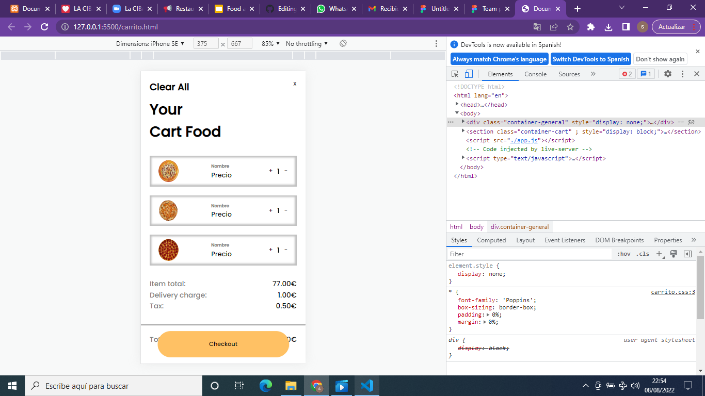
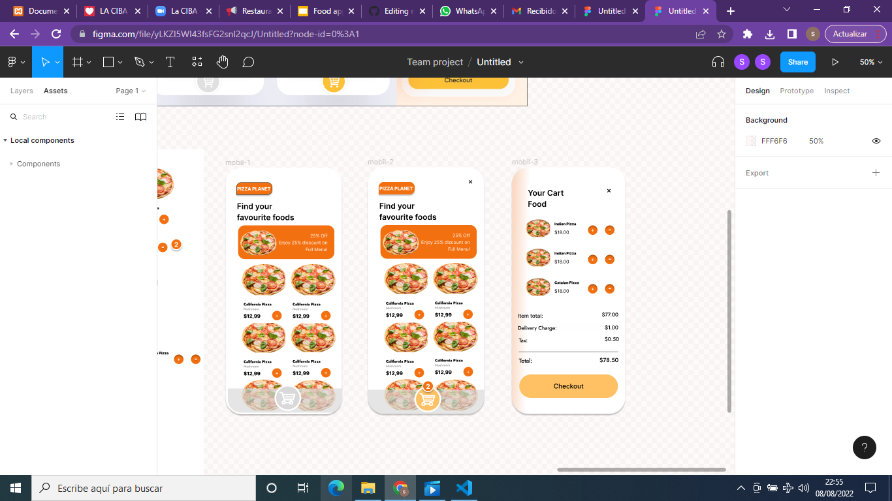

# RESTAURANT FOR SIX

***

## Tabla de Contenidos

1. [Información General](#información-general)
2. [Capturas de Pantalla](#capturas-de-pantalla)
3. [Tecnologías](#tecnologías)
4. [Instalación](#instalación)
5. [Soporte](#soporte)
6. [Hoja de ruta](#hoja-de-ruta)
7. [Autores](#autores)
***

## Información General

Un cliente nos solicitó la creación de una app para su restaurante de comida a domicilio, que se enfocase en la comodidad y la usabilidad de esta; que se centrase enn un major experiencia por parte del usuario.
Como característica principal del diseño se nos pidió que fuese mobile first(responsive) era que esta app debía ser mobile, tener un carrito de compras con un contador de productos (sumar y eliminar productos).
*Proyecto en proceso de desarrollo.*   
***

## Capturas de pantalla
)
***

***

***

## Tecnologías

* HTML: Version HTML 5 
* CSS: Version CSS3
* Javascript
***

## Instalación
Como instalar el repositorio:

1. Ingresar en Visual Studio Code
2.  Clonar el proyecto con el comando: 
 ``` 
https://github.com/gilsusana/restaurantforsix.git
 ```
***

## Soporte

Si tiene cualquier problema póngase en contacto con: 
> emailEjemplo@gmail.com
***

## Hoja de ruta

En nuestra primera entrega presentamos la maquetación de la app del restaurante, con el sistema mobile first.
Las siguientes actualizaciones serán para hacer responsive el diseño, mejorar la naevgación e interacción, un crud en el carrito, crear un mensaje y  enviar api a través de whatsapp; poder dar la opción de pagar por stripe/paypal etc y  consumir api del menú
***


## Autores

* **Susana Gil**
* **Dina Yamani**
* **Rosa Becerra**
* **Laia Añó**
* **Nadiale Bados**
